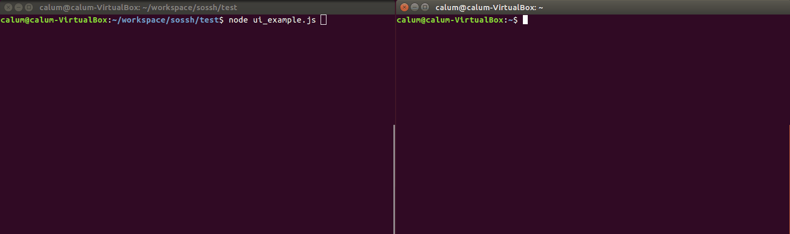

# SOSSH (Stream Over SSH)
_inspired by Express_

SOSSH is a server for streaming data over SSH. SOSSH is still in the early stages of development.

For a basic chat room example with multiple connections, built with SOSSH, check out `test/chatroom_example.js`.
See the example SOSSH chat room running at `$ ssh 34.240.227.222 -p 2222` (skip any login questions with `Enter`).



## Install

```sh
$ npm install --save sossh
```

## Quick start

### Write an App

```js
var sossh = require('sossh')
var fs = require('fs')
var path = require('path')

var options = {
  banner: 'Hello, World!\nClick any key to begin...',
  privateKey: fs.readFileSync(path.join(__dirname, 'keys')),
  publicKey: fs.readFileSync(path.join(__dirname, 'keys.pub')),
  logger: console.log
}

var app = sossh(options)

// exit when 'q' is pressed
var exitOnQ = sossh.utils.exitOnKey
exitOnQ.setKey(71)
app.use(exitOnQ.exit)

app.use(sossh.utils.clear)

app.use(function(window, req, res) {
  res.write('You pressed: ' + req.buffer.toString())
})

app.listen(2222, '', () => {
  console.log('listening on port 2222')
})
```

### Connect a client
In this example, the client connects to the server with ssh and then hit the `a` key.

**Client**
```sh
$ ssh 127.0.0.1 -p 2222
Hello, World!
Click any key to begin...
You pressed: a
```

**Server**
```sh
$ node example.js
listening on port 2222
Client connected
```

## A more complicated example

The following example demonstrates how to use the built in user interface streamer to get input from the user.

```js
var sossh = require('sossh')
var fs = require('fs')
var path = require('path')

var options = {
  banner: 'Hello, World!\nClick any key to begin...',
  privateKey: fs.readFileSync(path.join(__dirname, 'keys')),
  publicKey: fs.readFileSync(path.join(__dirname, 'keys.pub')),
  logger: console.log
}

var app = sossh(options)

//app.use(sossh.utils.clear)
app.use(sossh.utils.arrowKeyParser)

// exit when 'q' is pressed
var exitOnQ = sossh.utils.exitOnKey
exitOnQ.setKey(71)
app.use(exitOnQ.exit)

// generate a user interface
var ui = sossh.utils.ui
ui.addOption("click me!", () => {
  // this callback function is called when the option
  // is selected with the spacebar
  console.log("user clicked option 1")
})
ui.addOption("don't click me!", () => {
  console.log("user clicked option 2")
})

app.use(ui.generate)

app.listen(2222, '', () => {
  console.log('listening on port 2222')
})
```

## Using blessed user interfaces
```js
app.display('/', (window, stream) => {
  // get a username
})

app.display('/chat-room', (window, stream) => {
  // display the chat room
})
```
